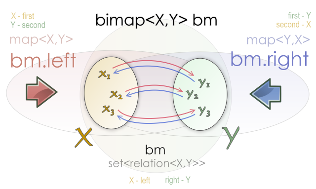
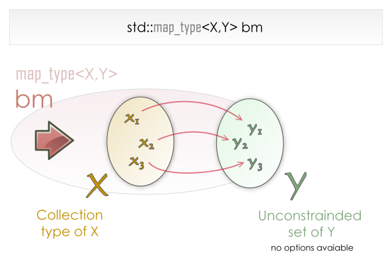

## bimap学习

[https://www.boost.org/doc/libs/1_84_0/libs/bimap/doc/html/index.html](https://www.boost.org/doc/libs/1_84_0/libs/bimap/doc/html/index.html)

### 什么是 bimap？

Bimap 是一种数据结构，用于表示两个集合中元素之间的双向关系。该容器被设计为两个相反的 STL 映射的工作方式。在集合 X 和集合 Y 之间的 bimap 可以被视为从 X 到 Y 的映射（称为左映射视图）或者从 Y 到 X 的映射（称为右映射视图）。此外，bimap 也可以被视为 X 和 Y 之间关系的集合（称为关系集视图）。

以下代码创建一个空的 bimap 容器：

```C++
typedef bimap<X,Y> bm_type;
bm_type bm;
```

根据这段代码，下面是对生成的 bimap 的完整描述。

bm.left 等价 std::map<X,Y>
bm.right 等价 std::map<Y,X>
bm 等价 std::set<relation<X,Y>>



您可以看到，bimap 容器提供了对同一双向关系集合的三个视图。

如果我们有任何可以处理映射的通用函数

```C++
template< class MapType >
void print_map(const MapType & m)
{
    typedef typename MapType::const_iterator const_iterator;
    for( const_iterator iter = m.begin(), iend = m.end(); iter != iend; ++iter )
    {
        std::cout << iter->first << “–>” << iter->second << std::endl;
    }
}
```

我们可以使用 left 映射视图和 right 映射视图

```C++
bimap< int, std::string > bm;
…
print_map( bm.left );
print_map( bm.right );
```

输出将会是

```
1 --> one
2 --> two
…
one --> 1
two --> 2
…
```

### 与map的异同

bimap 视图和它们的标准容器对应物之间的主要区别在于，由于 bimap 的双向性质，存储在其中的值不能直接使用迭代器进行修改。例如，当对 std::map<X,Y> 迭代器进行解引用时，返回类型是 std::pair<const X, Y>，因此以下代码是有效的：

```C++
m.begin()->second = new_value;
```

然而，解引用 bimap<X,Y>::left_iterator 返回一个与 std::pair<const X, const Y> 兼容的类型。

```C++
bm.left.find(1)->second = "1"; // Compilation error
```

如果您将 (1, “one”) 和 (1, “1”) 插入到 std::map<int, std::string> 中，第二次插入将没有效果。在 bimap<X,Y> 中，两个键都必须保持唯一。插入可能在其他情况下失败。让我们看一个例子。

```C++
bm.clear();

bm.insert( bm_type::value_type( 1, "one" ) );

bm.insert( bm_type::value_type( 1, "1"   ) ); // No effect!
bm.insert( bm_type::value_type( 2, "one" ) ); // No effect!

assert( bm.size() == 1 );
```


### 标准STL映射

一种解释双向映射的方法是将其视为两个数据集之间的函数，我们将它们称为左侧集合和右侧集合。双向映射中的一个元素是左侧集合中的一个元素与右侧集合中的一个元素之间的关系。左右两个集合的类型定义了双向映射的行为。我们可以从左侧视角查看存储的数据，它将左侧集合中的键与右侧集合中的数据进行映射，或者从右侧视角查看，它将右侧集合中的键与左侧集合中的数据进行映射。

STL 中数据之间的关系由映射表示。标准映射是左侧集合中键和右侧无约束集合中数据之间的有向关系。以下图示展示了所表示的关系以及用户的视角。



左侧集合类型取决于所选的映射类型。例如，如果映射类型是 std::multimap，则 X 的集合类型是 multiset_of。以下表格显示了 std 关联容器的等效类型。

| container          | left collection type   | right collection type |
| ------------------ | ---------------------- | --------------------- |
| map                | set_of                 | no constraints        |
| multimap           | multiset_of            | no constraints        |
| unordered_map      | unordered_set_of       | no constraints        |
| unordered_multimap | unordered_multiset_of` | no constraints        |
